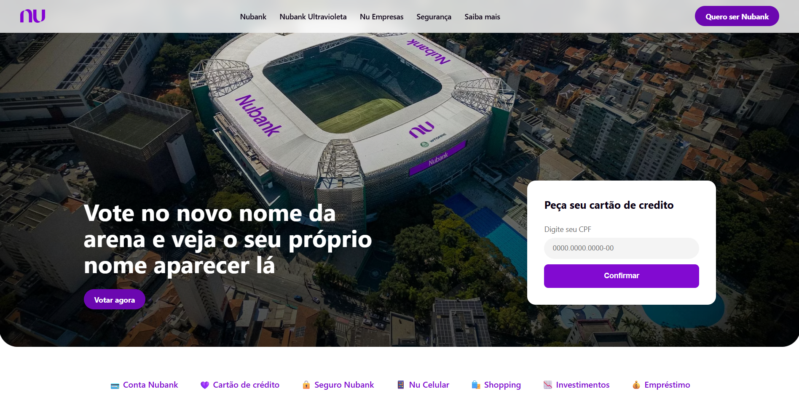

# Réplica Nubank

Projeto de estudo com o objetivo de praticar HTML e CSS, inspirado no layout do site do Nubank.

> 📚 Projeto feito acompanhando uma aula/curso, com foco em fixar fundamentos de HTML e CSS puro (sem JavaScript). Não é uma réplica pixel-perfect nem responsivo — o foco foi praticar estrutura e estilização.

🔗 **Acesse:** https://site-nubank-aula.vercel.app/

## 🚀 Tecnologias

- HTML
- CSS

## ✨ O que pratiquei

- Estruturação de layout com HTML semântico
- Estilização com CSS puro (cores, tipografia, espaçamento, posicionamento)

## 💻 Rodando localmente

\`\`\`bash
git clone [https://github.com/samuelsilvaa/site-nubank-aula.git]
cd nome-da-pasta